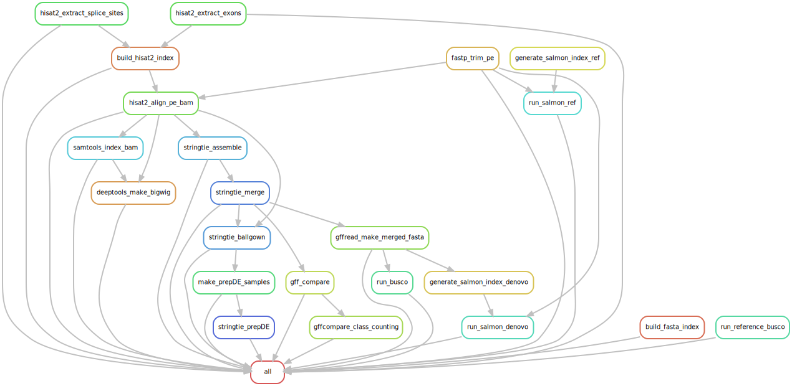

# Tango: A Snakemake Pipeline for Time-series ANalysis of Gene (and transcript!) Oscillations

Tango is a Snakemake-based RNA-seq processing pipeline built for time-series experiments where you want reliable **gene- and transcript-level** quantification (salmon) using a **reference genome/annotation**, with an optional **genome-guided de novo transcriptome** assembly (via StringTie) for exploring novel isoforms. Starting from paired-end FASTQ files, Tango performs trimming + QC, splice-aware alignment, transcript assembly/merging, annotation comparison, QC (e.g., BUSCO), and Salmon quantification against a **reference transcriptome** and/or a **StringTie-merged transcriptome**. Where possible, steps are **streamed/piped between tools** (e.g., aligner → BAM processing) to avoid writing large intermediate files and help keep scratch usage manageable.

- **Rulegraph (SVG):** [rulegraph.svg](tango/SnakeFiles/rulegraph.svg)



---

## What Tango does

Given paired-end RNA-seq reads and a reference genome/annotation, Tango runs:

- **fastp**: adapter/quality trimming + per-sample HTML/JSON QC
- **HISAT2**: splice-aware alignment to the genome (with exon/splice-site guided index)
- **samtools**: BAM sorting + indexing
- **deepTools**: BigWig generation for genome browser visualization
- **StringTie**: per-sample transcript assembly, merge, and Ballgown tables
- **prepDE.py**: gene/transcript count matrices (DESeq2-ready CSVs)
- **gffcompare**: comparison of merged transcripts vs reference annotation (class codes, tracking, stats)
- **gffread**: FASTA export of merged transcriptome from merged GTF
- **BUSCO**: assembly QC on denovo transcriptome, plus optional BUSCO on a provided reference transcriptome
- **Salmon (decoy-aware)**: quantification against both:
  - the **reference transcriptome** (`ref_quant`)
  - the **denovo transcriptome** (`denovo_quant`)

---

## Repo layout

Key locations:

- `tango/SnakeFiles/Snakefile` — main workflow
- `tango/SnakeFiles/tango_Snakemake_config.yaml` — user config (paths + output dir)
- `tango/SnakeFiles/ClusterProfiles/slurm/` — example SLURM executor profile
- `tango/RawData/` — optional place to put reads (see input structure below)
- `tango/Genome/` — optional place to put genome FASTA + GFF
- `tango/Utils/` — helper scripts used by the workflow
- `tango_envi.yml` — conda environment for Tango

---

## Important note about output locations (scratch recommended)

**Your output directories do NOT need to live inside the `tango/` repository.**  
In fact, for HPC usage it’s typically best to write outputs to **scratch space** (recommended), e.g. `/scratch/.../tango_output_run1/`.

The examples currently in the `tango/SnakeFiles/tango_Snakemake_config.yaml` file currently have some examples of these directories based on a previous analysis I ran.

This is controlled by:

- `output_dir:` in `tango/SnakeFiles/tango_Snakemake_config.yaml`

Similarly, your raw reads do not need to be copied into the repo:

- `rawdata_dir:` in the same config (can be an absolute scratch path)

Keeping large, frequently-written outputs on scratch will:
- avoid filling home/project quotas,
- speed up I/O-heavy steps,
- keep the git repo lightweight.

---

## Requirements

You’ll need a working conda (or mamba) install.

Tools included in the provided environment:
- snakemake
- fastp, hisat2, samtools, deeptools
- stringtie, gffcompare, gffread
- busco
- salmon
- multiqc
- (optional) snakemake SLURM executor plugin

---

## Installation

From the repo root:

```bash
conda env create -f tango_envi.yml
conda activate tango
```
Tip: You may want to delete the prefix: line in tango_envi.yml if it points to a path that doesn’t exist on your system.

---
## Inputs

### 1) Raw reads (paired-end)

Tango expects paired-end reads named:

- `{sample}_1.fq.gz`
- `{sample}_2.fq.gz`

…and organized like:

```
RAW_DIR/
├── SampleA
│ ├── SampleA_1.fq.gz
│ ├── SampleA_2.fq.gz
├── SampleB
│ ├── SampleB_1.fq.gz
│ ├── SampleB_2.fq.gz
└── ...
```

The `{sample}` name is discovered automatically from files matching:

- `{rawdata_dir}/{sample}/{sample}_1.fq.gz`

---

### 2) Reference files

You provide paths in the config:

- `fasta`: reference genome FASTA (`.fa`, `.fasta`, etc.)
- `gff`: reference annotation GFF (`.gff`, `.gff3`, etc.)
- `trans_fasta`: reference transcriptome FASTA (used for Salmon `ref_quant` + optional BUSCO)

---

### 3) HISAT2 index extension

If your genome is large (≥4 Gbp), HISAT2 may require the `ht2l` index format. Control this with:

- `hisat2_index_extension: "ht2"` or `"ht2l"`

---

## Configuration

Edit:

- `./tango/SnakeFiles/tango_Snakemake_config.yaml`

Key fields:

- `rawdata_dir`: directory containing sample subfolders with FASTQs (can be absolute)
- `fasta`: path to genome FASTA
- `gff`: path to genome annotation GFF
- `trans_fasta`: path to reference transcriptome FASTA (recommended if available)
- `hisat2_index_extension`: `ht2` (default) or `ht2l` for large genomes
- `output_dir`: where all outputs will be written (**scratch recommended**)
- `utils_dir`: leave as-is unless you moved the repo structure

---

## Running Tango

### Option A: Run locally (single machine)

From `tango/SnakeFiles/`:

```bash
cd tango/SnakeFiles
snakemake -j 8 -p
```

Adjust -j to match your available cores.

---

## Option B: Run on SLURM (recommended for HPC)

This repo includes a SLURM executor profile:

- `tango/SnakeFiles/ClusterProfiles/slurm/config.yaml`

From `tango/SnakeFiles/`:

```bash
cd tango/SnakeFiles
snakemake --workflow-profile ClusterProfiles/slurm -p
```

There is also an example sbatch launcher:
- `tango/SnakeFiles/execute_snakemake.sbatch`
You will likely want to edit the SLURM partition/account/QOS/email settings in the profile and sbatch script to match your cluster.

---
## Test mode (dry-run) and DAG visualization

If you’re new to Snakemake, it’s a good idea to run Tango in **test mode** first to confirm that Snakemake can find your inputs and that the planned jobs look correct.

### Dry-run (test mode)

A dry-run shows what *would* run without executing anything:

```bash
cd tango/SnakeFiles
snakemake -n -p
```
### Create a DAG image of the workflow

You can visualize the dependency graph (DAG) of the workflow. This requires `graphviz` (`dot`) to be available on your system.

From `tango/SnakeFiles/`:

```bash
# Generate a DAG file and render it to PNG
snakemake --dag | dot -Tpng > tango_dag.png
```

If you want to see rule-level dependencies (often cleaner):
```snakemake --rulegraph | dot -Tpng > tango_rulegraph.png```

### Snakemake documentation
If you’re unfamiliar with Snakemake, the official docs are a great starting point:

- Snakemake documentation: https://snakemake.readthedocs.io/

- Snakemake CLI reference: https://snakemake.readthedocs.io/en/stable/executing/cli.html

## Outputs (what to expect)

All outputs are written under `output_dir` and organized into subfolders:

- `fastp/` — trimmed FASTQs + fastp reports
- `hisat2_index/` — HISAT2 index + exon/splice-site files + logs
- `hisat2_samtools/` — sorted BAMs, BAI indices, BigWigs, FASTA index, logs
- `stringtie/` — per-sample assemblies, merged GTF/FASTA, Ballgown tables, prepDE count matrices
- `gff_compare/` — gffcompare outputs + class code summaries
- `busco/` — BUSCO runs (denovo transcriptome + reference transcriptome if provided)
- `salmon/`
  - `ref_quant/` — Salmon index + per-sample quants vs reference transcriptome
  - `denovo_quant/` — Salmon index + per-sample quants vs denovo transcriptome

---

## Tips / troubleshooting

- **Disk usage:** BAMs, BigWigs, Salmon indices, and BUSCO downloads can be large—use scratch (`output_dir`) whenever possible.
- **Sample discovery:** if Snakemake finds zero samples, double-check:
  - subfolder names match file prefixes exactly
  - files are named `{sample}_1.fq.gz` and `{sample}_2.fq.gz`
- **Reference transcriptome:** if you don’t have one, you can still run most of the pipeline, but `ref_quant` and reference BUSCO require `trans_fasta`.
- **Re-running:** Snakemake will skip completed outputs; delete specific output folders (or targets) if you want to force regeneration.

---

## Acknowledgments / credits

Tango wraps widely used open-source bioinformatics tools (fastp, HISAT2, samtools, deepTools, StringTie, gffcompare/gffread, BUSCO, Salmon) via Snakemake. Please cite the underlying tools appropriately in publications.

## Documentation note

Portions of this documentation were drafted with assistance from **ChatGPT (GPT-5.2 Thinking, OpenAI; February 2026)** and were reviewed/edited by **Daniel Kunk**.
